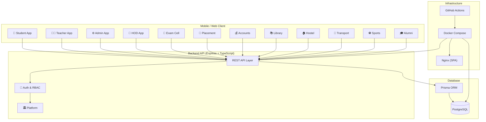

# Learnix — College ERP Platform

<div align="center">


A full-stack, multi-tenant college management system with **14 role-specific apps**, **286+ API endpoints**, and **132 wired features** — built to production standards.

[Getting Started](#getting-started) · [Architecture](#architecture) · [Features](#features) · [Demo Users](#demo-users) · [Deployment](#deployment)

</div>

---

## Architecture



---

## Features

| Domain | App | Key Features |
|--------|-----|-------------|
| **Academics** | Student, Teacher, HOD | Enrolled classes, syllabus tracking, lecture notes, quizzes, assignments, attendance, grade entry, performance analytics |
| **Examinations** | Exam Cell | Exam scheduling, hall tickets (QR), room allocation, evaluation tracking, results, re-evaluation, cheating cases |
| **Placements** | Placement Cell | Company profiles, job postings, placement drives, application pipeline, offer management |
| **Finance** | Accounts | Fee structures, dues, payments, receipts, payroll, expenses, scholarships, unified ledger |
| **Campus Life** | Library, Hostel, Transport, Sports | Book circulation, hostel blocks/mess/gate passes, bus tracking (GPS), tournaments, equipment |
| **Community** | Alumni | Directory, donations, mentorship pairs, chapters |
| **Administration** | Admin, Platform | KPI dashboard, CRUD for all entities, announcements, reports, settings, RBAC |

---

## Tech Stack

| Layer | Technology |
|-------|-----------|
| **Backend** | Express 5 · TypeScript · Zod validation · JWT auth (access + refresh rotation) |
| **Database** | PostgreSQL 16 · Prisma ORM (127 models, 40 schema files) · Multi-tenant (`institutionId` scope) |
| **Frontend** | Expo / React Native · Role-specific apps · 752 page files |
| **Infrastructure** | Docker Compose (backend + postgres + nginx) · GitHub Actions CI/CD |

---

## Getting Started

### Prerequisites
- Node.js 22+
- Docker (optional, for containerized deployment)

### Quick Start

```bash
# Clone the repo
git clone https://github.com/your-org/learnix.git
cd learnix

# Backend
cd backend
cp ../.env.example .env    # edit secrets for production
npm install
npx prisma db push --schema prisma/schema
npx tsx prisma/seed.ts
npx tsx prisma/seed-realistic.ts   # realistic demo data
npx tsx src/server.ts

# Frontend (new terminal)
cd learnix
npm install
npx expo start
```

### Docker (one command)

```bash
docker compose up --build
# Backend: http://localhost:4000
# Web:    http://localhost:80
```

---

## Demo Users

All passwords: `Passw0rd!`

| Role | Email | Description |
|------|-------|-------------|
| Student | `student@learnix.dev` | Arjun Kumar, B.Tech CSE Sem 4 |
| Teacher | `teacher@learnix.dev` | Anita Sharma, Asst. Professor |
| Admin | `admin@learnix.dev` | System Administrator |
| HOD | `hod@learnix.dev` | Dr. Meena Iyer, CSE Dept |
| Exam Cell | `examcell@learnix.dev` | Examination Coordinator |
| Placement | `placement@learnix.dev` | Training & Placement Officer |
| Accounts | `accounts@learnix.dev` | Finance Manager |
| Library | `library@learnix.dev` | Chief Librarian |
| Hostel | `hostel@learnix.dev` | Warden, Boys Hostel A |
| Transport | `transport@learnix.dev` | Transport Manager |
| Sports | `sports@learnix.dev` | Sports Coordinator |
| Alumni | `alumni@learnix.dev` | Alumni Relations Director |

---

## Project Structure

```
learnix/
├── backend/          # Express + TypeScript API
│   ├── src/modules/  # 14 domain modules (auth, student, teacher, admin, ...)
│   ├── prisma/       # Schema (40 files) + seed scripts
│   └── scripts/      # Smoke tests, CI helpers
├── learnix/          # Expo React Native app
│   ├── users/        # 12 role-specific apps (students/, teachers/, admin/, ...)
│   └── services/     # API client (shared)
├── docs/             # Documentation (source of truth)
│   ├── backend/      # Architecture, schema, API surface, state machines
│   └── users/        # Per-role feature contracts
├── docker-compose.yml
└── .github/workflows/ci.yml
```

---

## CI/CD Pipeline

The GitHub Actions workflow runs on every push:

| Job | What it does |
|-----|-------------|
| **Typecheck** | `tsc --noEmit` across the backend |
| **Smoke** | Spins up Postgres, seeds data, boots server, runs 19 endpoint tests |
| **Web Build** | `expo export --platform web` (1105 modules, 0 errors) |
| **Docker** | Builds and caches the backend Docker image |

---

## Deployment

### Production Checklist

- [ ] Set strong `JWT_ACCESS_SECRET` and `JWT_REFRESH_SECRET`
- [ ] Set `CORS_ORIGIN` to your domain(s)
- [ ] Enable `TRUST_PROXY=true` behind nginx/load balancer
- [ ] Run `DATABASE_SEED=true` on first boot to seed demo data
- [ ] Set `NODE_ENV=production` for hardened middleware (Helmet, rate limiting)

### Environment Variables

See [`.env.example`](.env.example) for the full list.

---

## Documentation

- [Architecture & Decisions](docs/backend/00-decisions.md)
- [Database Schema](docs/backend/02-database-schema.md) — 127 models across 12 domains
- [API Surface](docs/backend/04-api-surface.md) — 286+ endpoints
- [State Machines](docs/backend/05-state-machines.md) — every status flow
- [Feature List](docs/backend/07-feature-list.md) — 132 features, all wired

---

## License

MIT
