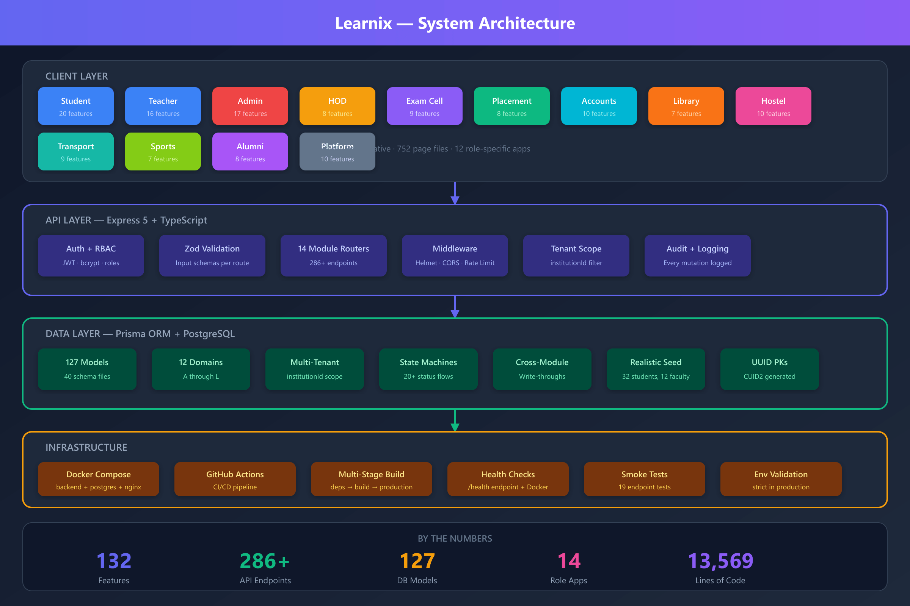
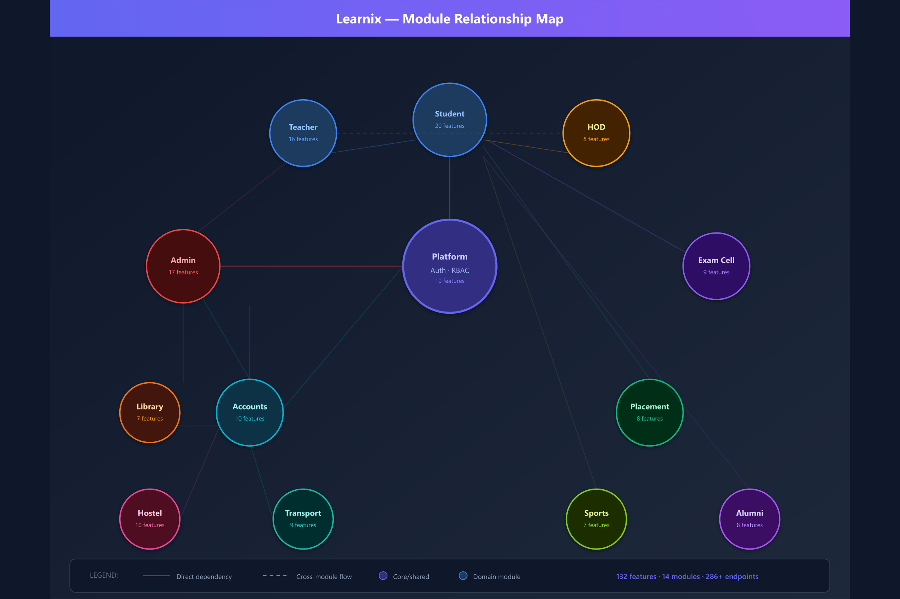
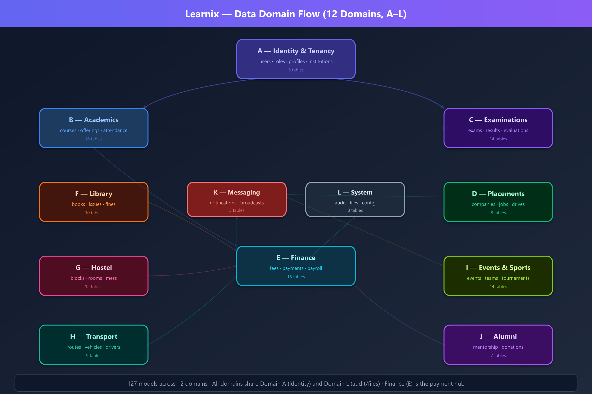

# Learnix — College ERP Platform

<div align="center">


A full-stack, multi-tenant college management system with **14 role-specific apps**, **286+ API endpoints**, and **132 wired features** — built to production standards.

[Getting Started](#getting-started) · [Architecture](#architecture) · [Features](#features) · [Demo Users](#demo-users) · [Deployment](#deployment)

</div>

---

## Architecture

<p align="center">
  
</p>

<p align="center">
  
</p>

<p align="center">
  
</p>

> SVG sources: [`docs/diagrams/`](docs/diagrams/) — regenerate PNGs with `node convert.js`

---

## Features

### Complete Feature List (132 features across 14 modules)

<details>
<summary><strong>📱 Student App (20 features)</strong></summary>

| ID | Feature | Status |
|----|---------|--------|
| S-01 | Home dashboard (live class widget, attendance %, pending work, notices) | ✅ |
| S-02 | My classes: enrolled offerings list + class detail | ✅ |
| S-03 | Syllabus tracker (units/topics progress, % complete) | ✅ |
| S-04 | Lecture notes reader (published notes + attachments) | ✅ |
| S-05 | Practice quizzes: attempt, timer, MCQ/TF auto-grade, score | ✅ |
| S-06 | Assignments: list, detail, submit (text/file), see grade + feedback | ✅ |
| S-07 | Timetable: weekly view from master slots | ✅ |
| S-08 | Exam schedule + hall ticket (QR) + seat | ✅ |
| S-09 | Results view + re-evaluation request (window-gated) | ✅ |
| S-10 | Attendance detail (per subject, present/absent/late history) | ✅ |
| S-11 | Fee dues + pay (gateway later) + receipts download | ✅ |
| S-12 | Placement: browse jobs, apply, my applications, offers | ✅ |
| S-13 | Events: browse, register (QR pass), my registrations | ✅ |
| S-14 | Library: my issued books, dues, request a book, digital resources | ✅ |
| S-15 | Hostel: my allocation, mess menu/feedback, gate pass request, complaints | ✅ |
| S-16 | Transport: my route/stop, live bus position, delay alerts, fee | ✅ |
| S-17 | Sports: join team/tournament, see fixtures | ✅ |
| S-18 | Alumni mentorship: my mentor, request sessions | ✅ |
| S-19 | Notifications inbox + AI Study Buddy chat | ✅ |
| S-20 | Profile (avatar upload → files, personal/academic info) | ✅ |
</details>

<details>
<summary><strong>👨‍🏫 Teacher App (16 features)</strong></summary>

| ID | Feature | Status |
|----|---------|--------|
| T-01 | Teacher dashboard (today's classes, pending grading, alerts) | ✅ |
| T-02 | My classes matrix: subject ↔ section ↔ semester (multi-class core) | ✅ |
| T-03 | Class dashboard per offering (stats, shortcuts) | ✅ |
| T-04 | Lecture notes CRUD (draft→publish, attachments) | ✅ |
| T-05 | Quiz builder (questions MCQ/TF, publish) + monitor attempts | ✅ |
| T-06 | Syllabus: create version, units/topics, submit to HOD | ✅ |
| T-07 | Syllabus tracker update (mark topics completed in class) | ✅ |
| T-08 | Roster: student list + roll numbers + quick profiles | ✅ |
| T-09 | Schedule: my weekly timetable + class sessions (join link) | ✅ |
| T-10 | Attendance: create session, mark, finalize, % + defaulters | ✅ |
| T-11 | Assignments: create (rubric, due), publish, close | ✅ |
| T-12 | Grading: submissions queue, rubric scoring, return/flag | ✅ |
| T-13 | Exam grade entry (feeds exam-cell evaluations) | ✅ |
| T-14 | Student performance analytics (per offering, AI insights) | ✅ |
| T-15 | Notifications + broadcast to my classes | ✅ |
| T-16 | Profile (staff card, workload) | ✅ |
</details>

<details>
<summary><strong>⚙️ Admin App (17 features)</strong></summary>

| ID | Feature | Status |
|----|---------|--------|
| A-01 | Institution dashboard (KPIs across all modules) | ✅ |
| A-02 | Students CRUD + approvals (rollNo, program, section) | ✅ |
| A-03 | Teachers/staff CRUD (employee, dept, workload) | ✅ |
| A-04 | Academics & Examinations (AI timetable generator + conflicts, cheating detection view) | ✅ |
| A-05 | Timetable master grid + lock slots | ✅ |
| A-06 | Attendance institution view + threshold alerts | ✅ |
| A-07 | Assignments oversight (all offerings) | ✅ |
| A-08 | Courses & Departments master CRUD | ✅ |
| A-09 | Fees: structures, revision approvals, dues oversight | ✅ |
| A-10 | Placements oversight: approve drives, view pipeline | ✅ |
| A-11 | Events: create/approve/publish (the approval queue) | ✅ |
| A-12 | Library oversight (catalog, circulation stats) | ✅ |
| A-13 | Hostel/Transport oversight reads | ✅ |
| A-14 | Announcements: author, approve queue, publish | ✅ |
| A-15 | Reports & exports (CSV per module) | ✅ |
| A-16 | Settings: academic years, config knobs, RBAC roles/permissions, feature flags | ✅ |
| A-17 | Notifications + audit log viewer | ✅ |
</details>

<details>
<summary><strong>🏢 HOD App (8 features)</strong></summary>

| ID | Feature | Status |
|----|---------|--------|
| HD-01 | Department dashboard (faculty workload, approvals pending, results) | ✅ |
| HD-02 | Faculty management: workload view, max-hours enforcement | ✅ |
| HD-03 | Syllabus approvals: SUBMITTED → HOD_APPROVED / CHANGES_REQUESTED | ✅ |
| HD-04 | Leave requests: approve/reject (+substitute arrangement) | ✅ |
| HD-05 | Students by year/section (department scope) | ✅ |
| HD-06 | Course offerings oversight for department | ✅ |
| HD-07 | Department results/attendance analytics | ✅ |
| HD-08 | Notifications + profile | ✅ |
</details>

<details>
<summary><strong>📝 Exam Cell (9 features)</strong></summary>

| ID | Feature | Status |
|----|---------|--------|
| X-01 | Dashboard (exams by status, pending evaluations, alerts) | ✅ |
| X-02 | Exam schedule: create exam + slots, conflict detection | ✅ |
| X-03 | Room allocations + invigilator duty | ✅ |
| X-04 | Hall tickets: batch generate (QR), download tracking | ✅ |
| X-05 | Evaluations: assign evaluator, paper progress, deadline reminders | ✅ |
| X-06 | Results: enter → publish (gated by exam status), student view | ✅ |
| X-07 | Re-evaluation window (config-gated) + decisions | ✅ |
| X-08 | Cheating cases: review → confirm/dismiss/escalate | ✅ |
| X-09 | Notifications + profile | ✅ |
</details>

<details>
<summary><strong>💼 Placement Cell (8 features)</strong></summary>

| ID | Feature | Status |
|----|---------|--------|
| P-01 | Dashboard (drives, applications, offers, CTC stats) | ✅ |
| P-02 | Companies CRUD + ratings | ✅ |
| P-03 | Jobs: post, open/close, applicant lists | ✅ |
| P-04 | Drives: create (eligibility JSON), submit for admin approval, schedule | ✅ |
| P-05 | Applications pipeline: shortlist → interview → offer/reject | ✅ |
| P-06 | Offers: extend, mark accepted/declined | ✅ |
| P-07 | Student eligibility pool + drive registration + attendance | ✅ |
| P-08 | Notifications + profile | ✅ |
</details>

<details>
<summary><strong>💰 Accounts & Finance (10 features)</strong></summary>

| ID | Feature | Status |
|----|---------|--------|
| F-01 | Dashboard (collections vs dues, payroll status, budget burn) | ✅ |
| F-02 | Collections: record payment (any category) + auto receipt no. | ✅ |
| F-03 | Fee structures (per program×AY) + revision approvals | ✅ |
| F-04 | Fee dues: generate per semester, reminders, waive (audited) | ✅ |
| F-05 | Unified ledger: all money-in incl. fines/rent/transport/donations | ✅ |
| F-06 | Payroll: run per month, entries, payslips | ✅ |
| F-07 | Expenses: approve/reject + budget updates (denorm) | ✅ |
| F-08 | Scholarships: create, award, disburse → payment/write-off | ✅ |
| F-09 | Finance reports (reconciliation: payments = receipts) | ✅ |
| F-10 | Notifications + profile | ✅ |
</details>

<details>
<summary><strong>📚 Library Staff (7 features)</strong></summary>

| ID | Feature | Status |
|----|---------|--------|
| L-01 | Dashboard (issued, overdue, pending requests) | ✅ |
| L-02 | Catalog CRUD (copies, racks) | ✅ |
| L-03 | Circulation: issue/return, overdue sweep → fine creation | ✅ |
| L-04 | Fines: collect (→ payments write-through) or waive (audited) | ✅ |
| L-05 | Book requests: approve → procurement pipeline | ✅ |
| L-06 | Digital library: resources + access grants | ✅ |
| L-07 | Notifications + profile | ✅ |
</details>

<details>
<summary><strong>🏠 Hostel (10 features)</strong></summary>

| ID | Feature | Status |
|----|---------|--------|
| H-01 | Dashboard (occupancy, pending passes, open complaints) | ✅ |
| H-02 | Blocks/rooms/beds grid (vacant/allocated/maintenance) | ✅ |
| H-03 | Allocations: allocate/transfer/vacate (+bed state, rent dues) | ✅ |
| H-04 | Residents list | ✅ |
| H-05 | Mess: weekly menu CRUD, meal attendance, feedback review | ✅ |
| H-06 | Gate passes: approve/reject, in/out times | ✅ |
| H-07 | Complaints: assign, resolve | ✅ |
| H-08 | Visitors: check-in/out | ✅ |
| H-09 | Rent dues tracking → payments write-through | ✅ |
| H-10 | Notifications + profile | ✅ |
</details>

<details>
<summary><strong>🚌 Transport (9 features)</strong></summary>

| ID | Feature | Status |
|----|---------|--------|
| R-01 | Dashboard (routes on road, service due, fee collection) | ✅ |
| R-02 | Routes CRUD + stops timeline | ✅ |
| R-03 | Fleet: vehicles CRUD, documents expiry alerts | ✅ |
| R-04 | Drivers: roster, duty status, license expiry | ✅ |
| R-05 | Student enrollment per route/stop | ✅ |
| R-06 | Live tracking: GPS ping upsert, ETA, delay status | ✅ |
| R-07 | Maintenance: service records + fuel logs | ✅ |
| R-08 | Transport fees: generate dues → collect via payments | ✅ |
| R-09 | Notifications + profile | ✅ |
</details>

<details>
<summary><strong>⚽ Sports & Cultural (7 features)</strong></summary>

| ID | Feature | Status |
|----|---------|--------|
| SP-01 | Dashboard (upcoming events, tournaments, equipment out) | ✅ |
| SP-02 | Events: create (admin approval), schedule items, volunteers, registration approvals | ✅ |
| SP-03 | Teams: create, roster, captain | ✅ |
| SP-04 | Tournaments: fixtures, results entry, standings auto-update | ✅ |
| SP-05 | Equipment: items CRUD, issue/return, overdue | ✅ |
| SP-06 | Venues: master + booking requests approve/reject | ✅ |
| SP-07 | Notifications + profile | ✅ |
</details>

<details>
<summary><strong>🎓 Alumni Relations (8 features)</strong></summary>

| ID | Feature | Status |
|----|---------|--------|
| AL-01 | Dashboard (engagement %, events, donations, mentorship) | ✅ |
| AL-02 | Directory: alumni list, filters, detail (message/invite/add-mentor) | ✅ |
| AL-03 | Events: ALUMNI category events, RSVP flow, announce | ✅ |
| AL-04 | Donations: campaigns CRUD, record pledge → payment + receipt write-through | ✅ |
| AL-05 | Mentorship: pairs approve/decline, reminders, sessions log | ✅ |
| AL-06 | Chapters: city chapters, presidents, members | ✅ |
| AL-07 | Notifications + broadcast (audience: batch/city/mentors) | ✅ |
| AL-08 | Profile (director card, program stats) | ✅ |
</details>

<details>
<summary><strong>🏛️ Platform & Shared (10 features)</strong></summary>

| ID | Feature | Status |
|----|---------|--------|
| X-01 | Auth: login (email+password, multi-role user), refresh rotation, logout, me | ✅ |
| X-02 | Password reset (email flow) | ✅ |
| X-03 | Platform admin: create institutions, first-admin provisioning | ✅ |
| X-04 | Master data reads (departments/programs/batches/sections/courses/AY) | ✅ |
| X-05 | Notification service: create/fan-out/mark-read (used by all modules) | ✅ |
| X-06 | Broadcast fan-out (audienceJson → notification rows) | ✅ |
| X-07 | Files: upload/download, purpose-tagged | ✅ |
| X-08 | Audit logging (every mutation) | ✅ |
| X-09 | Config + feature-flag resolution per institution | ✅ |
| X-10 | RBAC middleware (roles + permission keys) | ✅ |
</details>

---

## Tech Stack

| Layer | Technology |
|-------|-----------|
| **Backend** | Express 5 · TypeScript · Zod validation · JWT auth (access + refresh rotation) |
| **Database** | SQLite (PostgreSQL-ready via Prisma) · 127 models, 40 schema files · Multi-tenant (`institutionId` scope) |
| **Frontend** | Expo / React Native · Role-specific apps · 752 page files |
| **Infrastructure** | Docker Compose (backend + nginx web) · GitHub Actions CI/CD |

---

## Getting Started

### Prerequisites
- Node.js 22+
- Docker (optional, for containerized deployment)

### Quick Start

```bash
# Clone the repo
git clone https://github.com/your-org/learnix.git
cd learnix

# Backend
cd backend
cp ../.env.example .env    # edit secrets for production
npm install
npx prisma db push --schema prisma/schema
npx tsx prisma/seed.ts
npx tsx prisma/seed-realistic.ts   # realistic demo data
npx tsx src/server.ts

# Frontend (new terminal)
cd learnix
npm install
npx expo start
```

### Docker (one command)

```bash
docker compose up --build
# Backend: http://localhost:4000
# Web:    http://localhost:80
```

---

## Demo Users

All passwords: `Passw0rd!`

| Role | Email | Description |
|------|-------|-------------|
| Student | `student@learnix.dev` | Arjun Kumar, B.Tech CSE Sem 4 |
| Teacher | `teacher@learnix.dev` | Anita Sharma, Asst. Professor |
| Admin | `admin@learnix.dev` | System Administrator |
| HOD | `hod@learnix.dev` | Dr. Meena Iyer, CSE Dept |
| Exam Cell | `examcell@learnix.dev` | Examination Coordinator |
| Placement | `placement@learnix.dev` | Training & Placement Officer |
| Accounts | `accounts@learnix.dev` | Finance Manager |
| Library | `library@learnix.dev` | Chief Librarian |
| Hostel | `hostel@learnix.dev` | Warden, Boys Hostel A |
| Transport | `transport@learnix.dev` | Transport Manager |
| Sports | `sports@learnix.dev` | Sports Coordinator |
| Alumni | `alumni@learnix.dev` | Alumni Relations Director |

---

## Project Structure

```
learnix/
├── backend/          # Express + TypeScript API
│   ├── src/modules/  # 14 domain modules (auth, student, teacher, admin, ...)
│   ├── prisma/       # Schema (40 files) + seed scripts
│   └── scripts/      # Smoke tests, CI helpers
├── learnix/          # Expo React Native app
│   ├── users/        # 12 role-specific apps (students/, teachers/, admin/, ...)
│   └── services/     # API client (shared)
├── docs/             # Documentation (source of truth)
│   ├── backend/      # Architecture, schema, API surface, state machines
│   └── users/        # Per-role feature contracts
├── docker-compose.yml
└── .github/workflows/ci.yml
```

---

## CI/CD Pipeline

The GitHub Actions workflow runs on every push:

| Job | What it does |
|-----|-------------|
| **Typecheck** | `tsc --noEmit` across the backend |
| **Smoke** | Seeds database, boots server, runs 19 endpoint tests |
| **Web Build** | `expo export --platform web` (1105 modules, 0 errors) |
| **Docker** | Builds and caches the backend Docker image |

---

## Deployment

### Production Checklist

- [ ] Set strong `JWT_ACCESS_SECRET` and `JWT_REFRESH_SECRET`
- [ ] Set `CORS_ORIGIN` to your domain(s)
- [ ] Enable `TRUST_PROXY=true` behind nginx/load balancer
- [ ] Run `DATABASE_SEED=true` on first boot to seed demo data
- [ ] Set `NODE_ENV=production` for hardened middleware (Helmet, rate limiting)

### Environment Variables

See [`.env.example`](.env.example) for the full list.

---

## Documentation

- [Architecture & Decisions](docs/backend/00-decisions.md)
- [Database Schema](docs/backend/02-database-schema.md) — 127 models across 12 domains
- [API Surface](docs/backend/04-api-surface.md) — 286+ endpoints
- [State Machines](docs/backend/05-state-machines.md) — every status flow
- [Feature List](docs/backend/07-feature-list.md) — 132 features, all wired

---

## License

MIT
